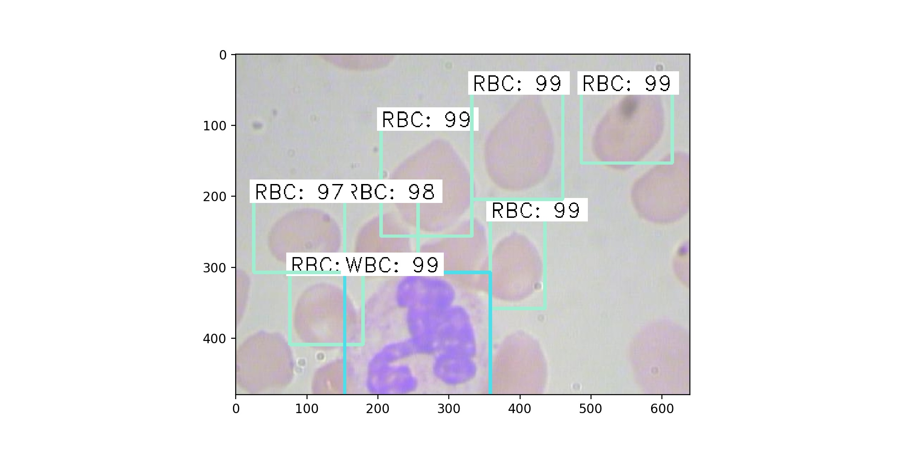
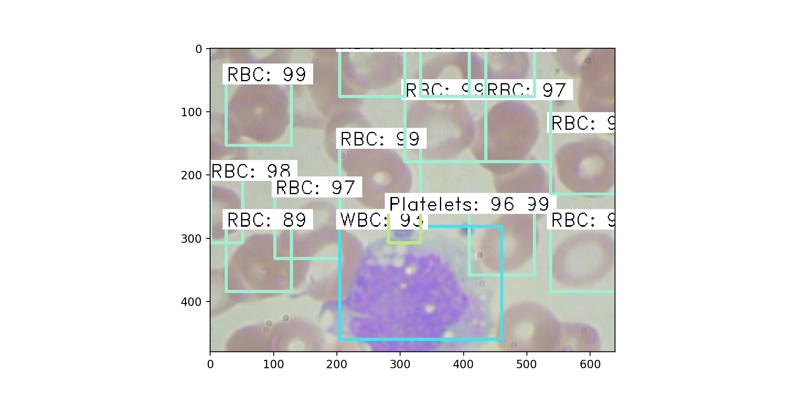
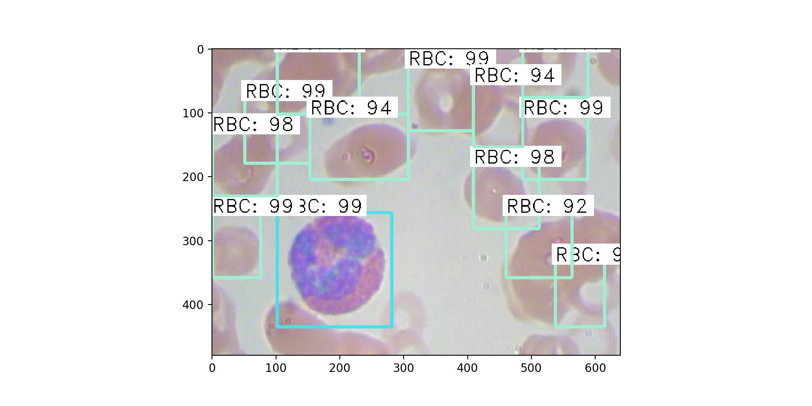
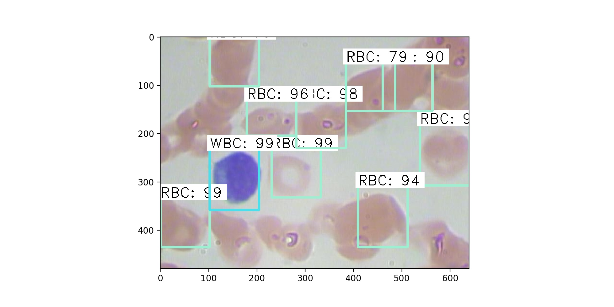
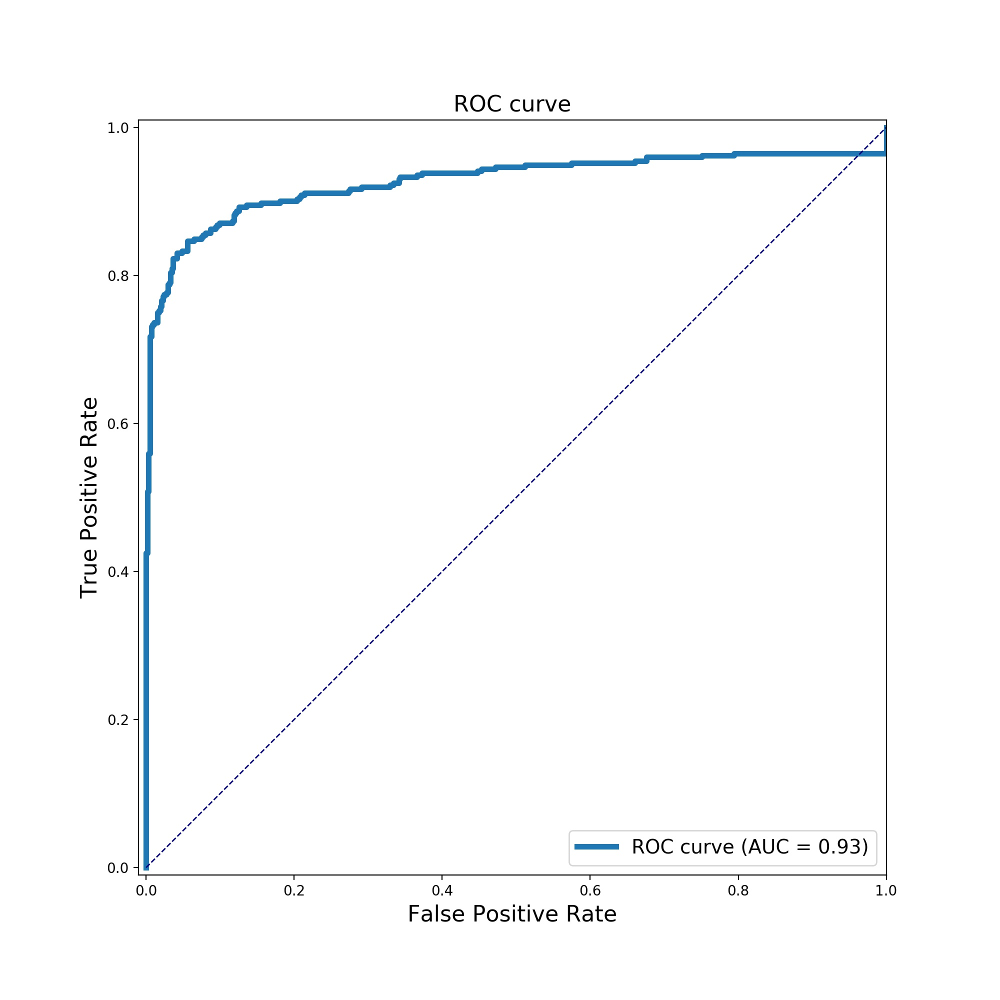
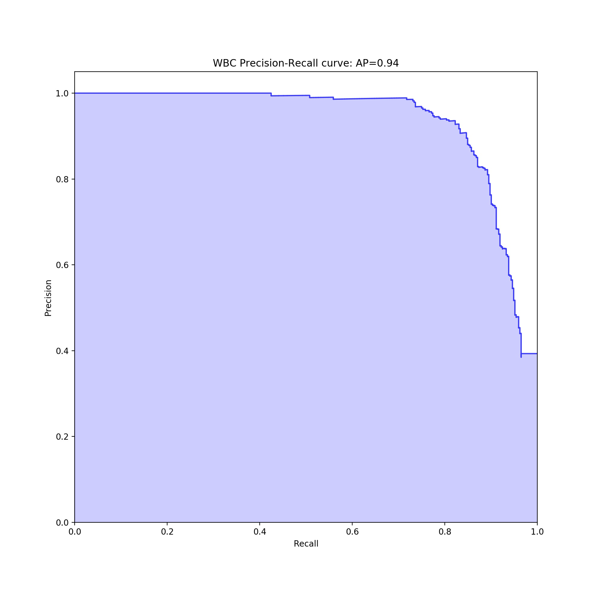
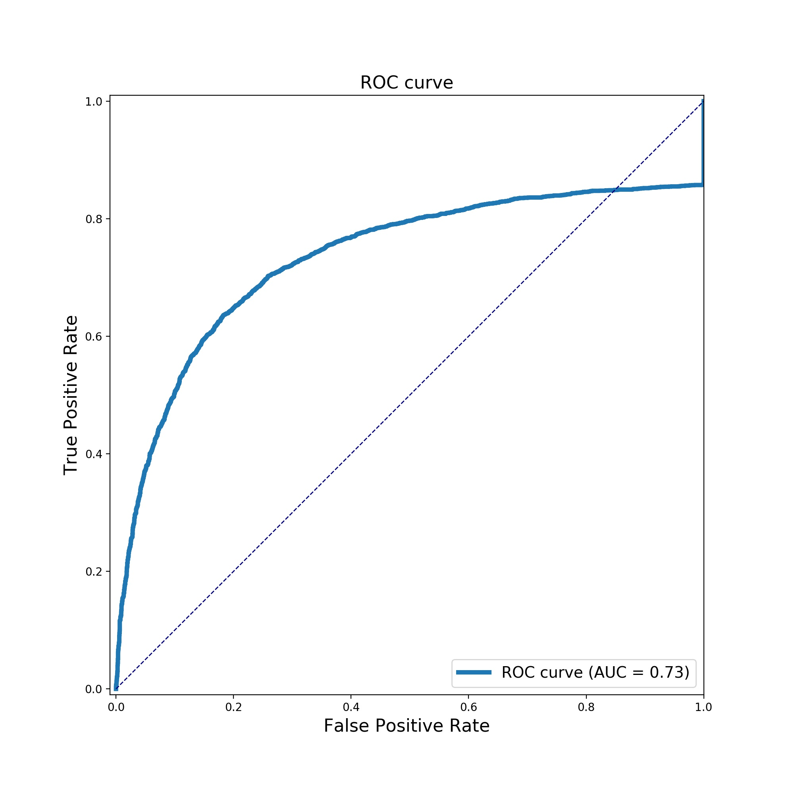
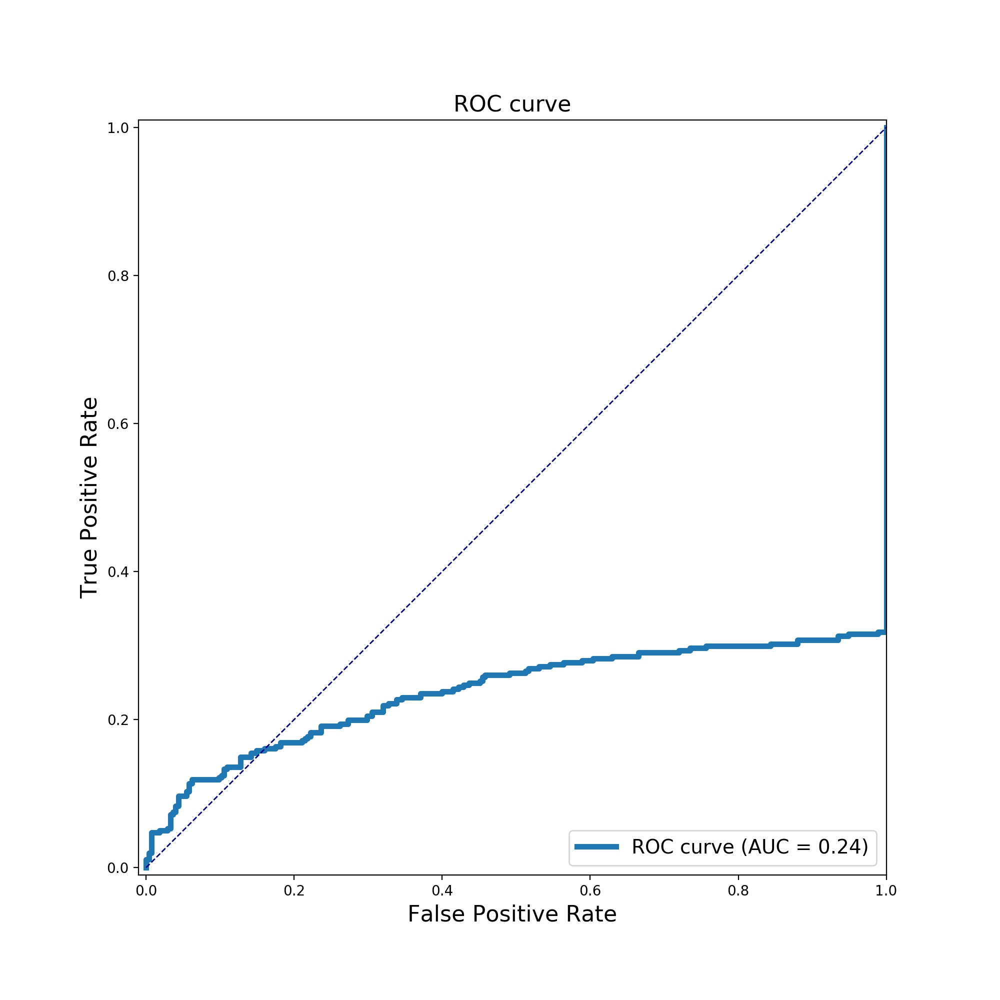

# Faster R-CNN for Open Images Dataset by Keras
## Introduction
This is my homework from the course of graduated school, and this was forked from [RockyXu66](https://github.com/RockyXu66/Faster_RCNN_for_Open_Images_Dataset_Keras)

## Project Structure
`Object_Detection_DataPreprocessing.ipynb` is the file to extract subdata from Open Images Dataset V4 which includes downloading the images and creating the annotation files for our training. I run this part by my own computer because of no need for GPU computation. `frcnn_train_vgg.ipynb` is the file to train the model. The configuration and model saved path are inside this file. `frcnn_test_vgg.ipynb` is the file to test the model with test images and calculate the mAP (mean average precision) for the model. If you want to run the code on Colab, you need to give authority to Colab for connecting your Google Drive. Then, you need to upload your annotation file  and training images to the Google Drive and change my path to your right path in the notebook.

## Result for some test images

     
    

     
     

## ROC curve and PRC curve

 

 

